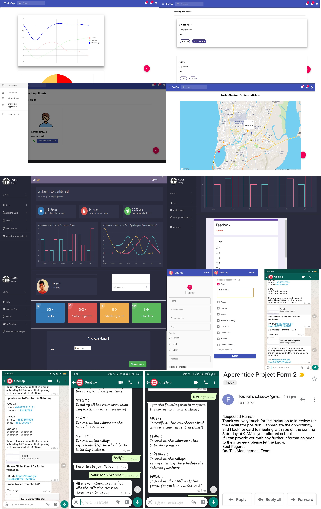

# OneTap
Automation of The Apprentice Project built at TSEC Hacks 2.0

# Table of Contents

* [Dependencies](https://github.com/amurto/OneTap#dependencies)
* [Installation](https://github.com/amurto/OneTap#installation)
  * [Prerequisites](https://github.com/amurto/OneTap#prerequisites)
  * [Instructions](https://github.com/amurto/OneTap#instructions)
* [Usage](https://github.com/amurto/OneTap#usage)
* [License](https://github.com/amurto/OneTap#license)
 
### Webapp Images


# Dependencies

* [npm](https://www.npmjs.com/)
* [Express.js](https://expressjs.com/)
* [MongoDB](https://www.mongodb.com/)
* [React.js](https://reactjs.org/)
* [Mapbox](https://www.mapbox.com/)

# Installation

### Prerequisites

Install Node.js and npm using the link above. Follow instructions on their respecive websites. Npm is included with Node.js. Setup MongoDB locally or on [MongoDB Atlas](https://www.mongodb.com/cloud/atlas) and get the connection string. This connection string has to be pasted [here](https://github.com/amurto/OneTap/blob/master/backend/app.js). 

### Instructions

Clone the repository
```bash
git clone https://github.com/amurto/OneTap.git
```

Install all the dependencies on facilitator client
```bash
cd facilitator
npm install
```

# Usage

Run the backend server
```bash
cd backend
npm start
```

Run the facilitator webapp
```bash
cd facilitator
npm start
```

Open a web browser and go to
```bash
http://localhost:3000
```

# License

[](https://opensource.org/licenses/MIT)

[MIT License Link](https://github.com/amurto/OneTap/blob/master/LICENSE)